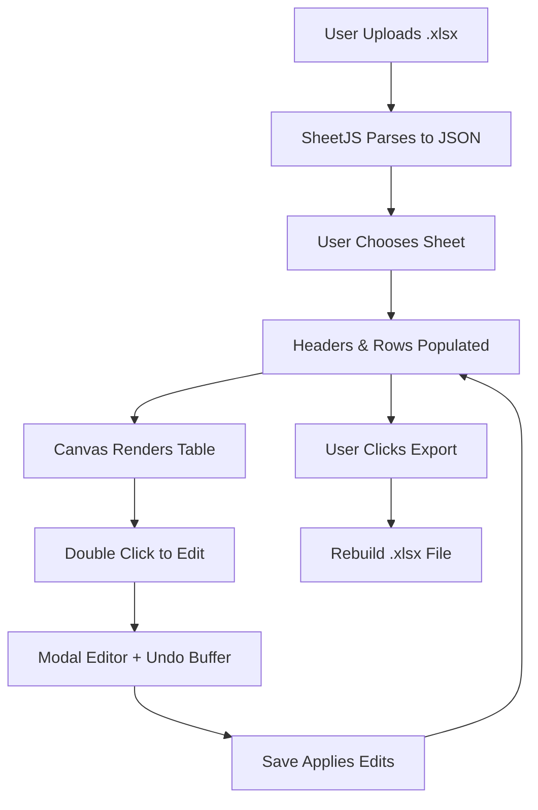

# 📘 Excel Table Embed Module — Updated Theory of Operation

## 🎯 Objective
Enable CtrlSketch Pro users to **import**, **view**, **edit**, and **export** Excel (.xlsx) tables directly within the browser-based CAD canvas, with enhanced editing control and user experience similar to Visio or AutoCAD OLE integration.

---

## 🧱 Component: `ExcelTableEmbed.vue`

### 🔹 Core Features
1. **Upload Excel File**
   - Accepts `.xlsx` files.
   - Parses with `xlsx.js` into a usable JSON array.

2. **Multi-Sheet Selection**
   - If the workbook has multiple sheets, a dropdown allows switching between them.

3. **Render Table to Canvas**
   - Displays the selected worksheet as a scrollable and scalable HTML table.
   - Uses auto-detected headers and rows for layout.

4. **Zoom & Pan Support**
   - Canvas supports zoom in/out via control buttons.
   - Table container allows panning via scroll.

5. **Edit Mode (Double-Click)**
   - Double-clicking a row opens a modal editor with input fields for all cell values.
   - Edits are saved back to the canvas on confirmation.

6. **Undo / Redo Stack**
   - Maintains up to 50 historical states.
   - Undo/redo changes in sequence using buttons.

7. **Export to Excel**
   - Rebuilds `.xlsx` file from in-memory table and triggers download.

---

## 🛠️ Technical Operation

### 🧩 Libraries Used
- [`xlsx`](https://github.com/SheetJS/sheetjs): Excel parsing and file generation.
- **Vue 3 Composition API**: `<script setup>` format for reactive logic.
- **Scoped CSS**: For styling modal, table, and canvas behavior.

---

### 🧬 Data Flow (Updated)

---

### 🗃️ Internal State Variables

| Variable      | Purpose                                  |
|---------------|-------------------------------------------|
| `tableData`   | Rendered table content                    |
| `headers`     | Header row extracted from Excel           |
| `editBuffer`  | Editable temp copy during modal edits     |
| `editMode`    | Modal visibility toggle                   |
| `sheetNames`  | List of available worksheet names         |
| `selectedSheet` | Current sheet selected for display      |
| `zoomLevel`   | Table rendering scale                     |
| `undoStack`   | Array of tableData snapshots              |
| `redoStack`   | Forward history for redo support          |

---

## 🧩 Integration Points

| Hook | Description |
|------|-------------|
| `@change="handleFileUpload"` | Loads Excel file |
| `@dblclick="enterEditMode"` | Enables row editing |
| `@click="applyChanges"` | Saves modal edits |
| `@click="exportToXLSX"` | Triggers `.xlsx` export |
| `@click="zoomIn/zoomOut"` | Adjusts rendering scale |
| `@click="undo/redo"` | History control |

---

## 🔄 Future Enhancements
- Link table cells to shape metadata (e.g., parts, nodes).
- Column-specific validation (numbers, SKUs, dates).
- Persistent syncing to cloud or Supabase backend.
- Keyboard navigation for edit modal.
- Cell formatting styles (font, align, wrap).

---

## 📂 Suggested File Path
`/src/components/ExcelTableEmbed.vue`

---

## ✅ Summary
The updated module brings CAD-integrated Excel handling to CtrlSketch Pro — now with editable, scalable, multi-sheet tables, full undo/redo stack, and direct export functionality. This enables precise control of engineering tables, BOMs, and schedules — without ever leaving the browser canvas.