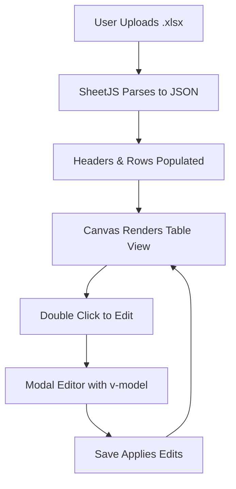

# 📘 Excel Table Embed Module — Theory of Operation

## 🎯 Objective
Enable CtrlSketch Pro users to **import**, **display**, and **edit** Excel (.xlsx) tables directly within the application. This mimics the workflow found in Visio or AutoCAD where embedded objects (OLE) can be double-clicked for editing and saved back into the drawing environment.

---

## 🧱 Component: `ExcelTableEmbed.vue`

### 🔹 Core Features
1. **Upload Excel File**
   - Accepts `.xlsx` files via a file input.
   - Uses the `xlsx.js` library to parse the file into JSON format.

2. **Render Table to Canvas**
   - Displays the first worksheet's data as a table on screen.
   - Dynamically builds the table using extracted headers and data rows.

3. **Edit Mode (Double-Click)**
   - Double-clicking the rendered table opens a modal editor.
   - All cell values are editable using inline input fields.
   - Changes are written back to the main display on save.

---

## 🛠️ Technical Operation

### 🧩 Libraries Used
- [`xlsx`](https://github.com/SheetJS/sheetjs): Parses Excel files into usable JavaScript objects.
- **Vue 3 Composition API** (`<script setup>`): Manages reactivity, state, and lifecycle.
- **CSS** (scoped): Handles layout, responsive rendering, and modal visibility.

### 🧬 Data Flow

### 🗃️ Internal State
- `tableData`: Holds the primary table state for rendering.
- `headers`: Auto-generated from the first row of parsed Excel data.
- `editBuffer`: Temporary editable copy used inside the modal.
- `editMode`: Boolean that toggles modal visibility.

---

## 🧩 Integration Points

| Hook | Purpose |
|------|---------|
| `@change="handleFileUpload"` | Triggers Excel parsing |
| `@dblclick="editMode = true"` | Enables editing |
| `@click="applyChanges"` | Commits updated table data |

---

## 🔄 Future Enhancements
- Link tables to shape metadata or BOM systems.
- Add multi-sheet selection.
- Support re-export to `.xlsx`.
- Add zoom, resize, and rotate for canvas rendering.
- Sync with Supabase for persistent storage.

---

## 📂 Suggested File Path
`/src/components/ExcelTableEmbed.vue`

---

## ✅ Summary
This module brings native-like Excel handling into CtrlSketch Pro, enabling embedded schedules, parts lists, and data tables to be seamlessly managed in a design environment. It mirrors the fluid OLE workflow familiar to Visio users — but entirely within a browser-based, Vue-driven CAD platform.

